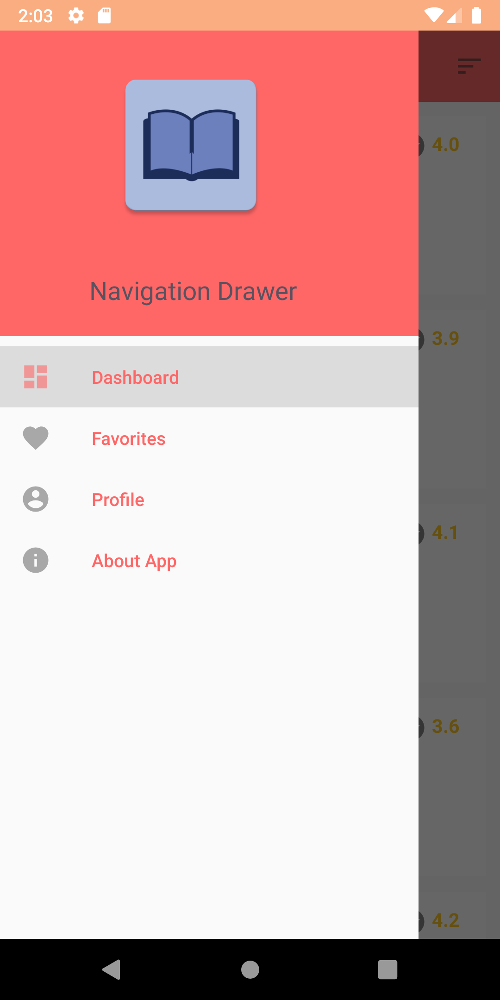
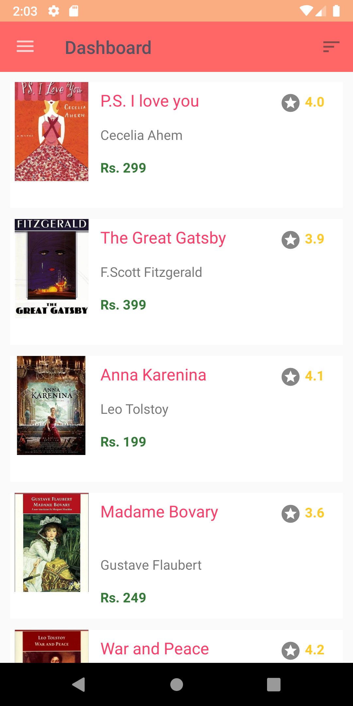
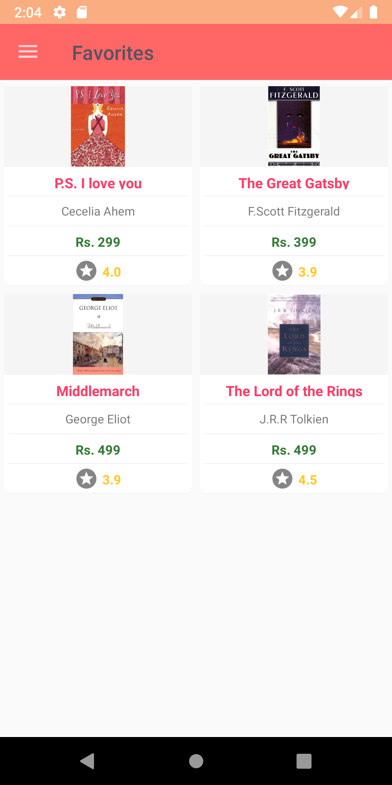
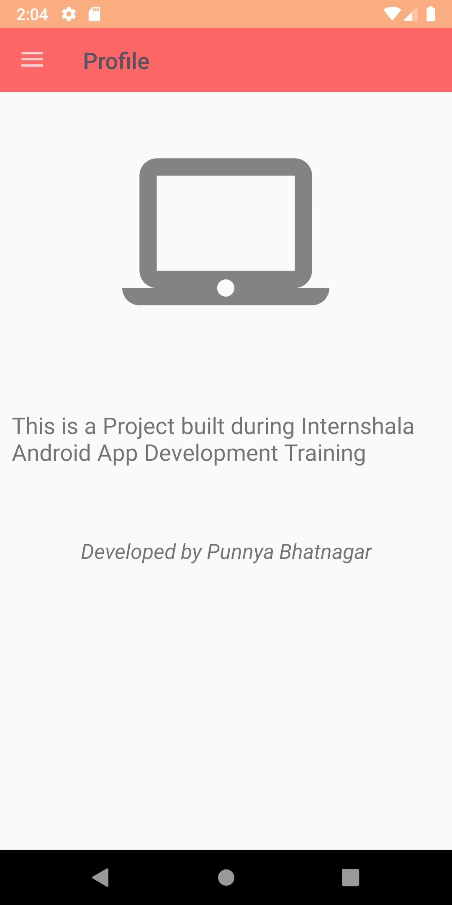
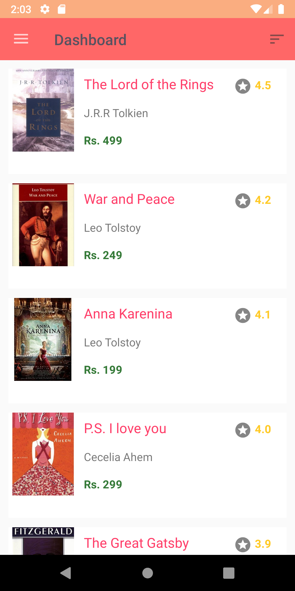
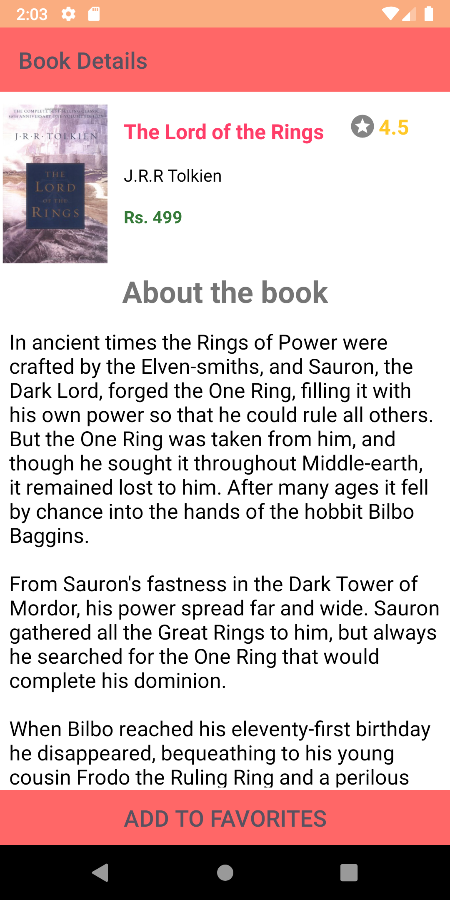
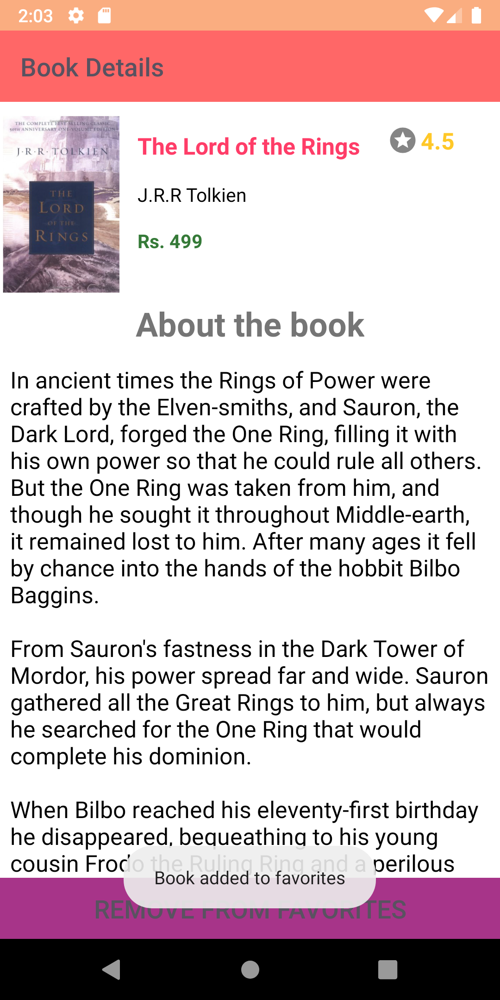

# AppDev_BookHub
<b>This is a project made during Internshala Android App Development Training. 
The BookHub App is a platform for avid readers. Read about the best books till date. Also, add them to your favorites.

Project Snapshots:</b>

<i>Splash Activity->
  

  
  
Navigation View->
  

  
  
Dashboard->
  

  
  
Favorites->
  

  
  
Profile->
  

  
  
About App->
  

  
  
Dashboard after sorting the books->
  

  
  
Description->
  

  
  
After adding to Favorites->
  

</i>
